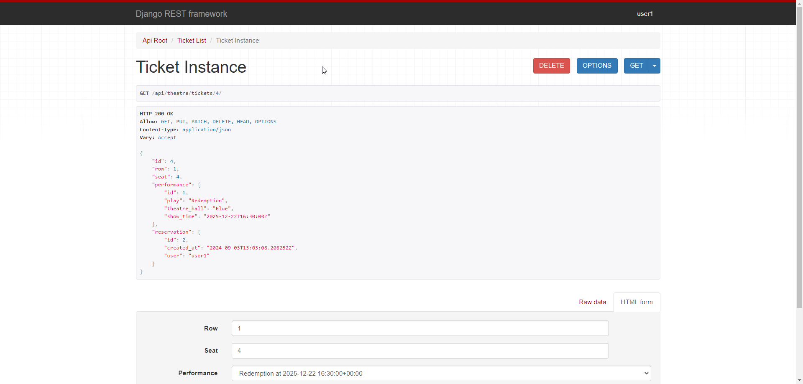
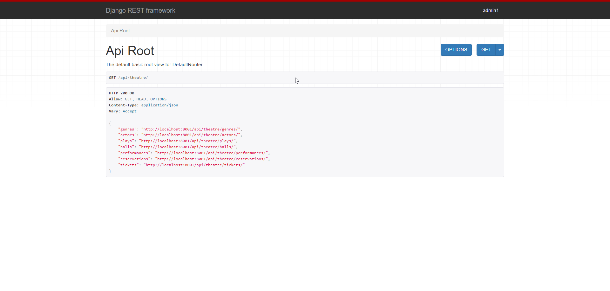
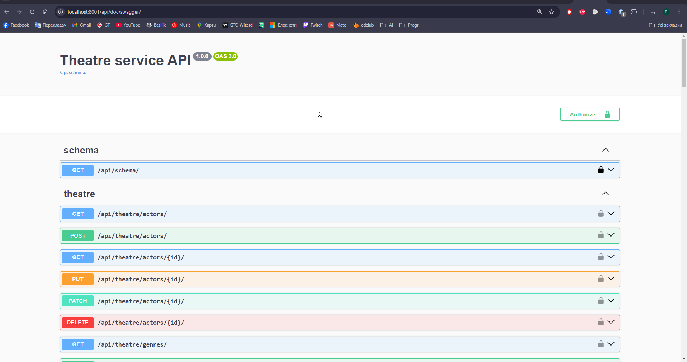
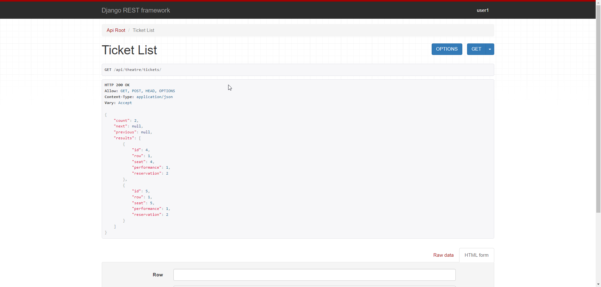

# Theatre Service API

Theatre Service API is a Django-based web application for theatre management. 
## Features

- **JWT authenticated**: Secure API access with JSON Web Tokens.
- **Admin panel /admin/**: Access the admin panel at `/admin/`.
- **Documentation is located at /api/doc/swagger/**
- **Managing reservation and tickets**
- **"CRUD" for all theatre objects for only admin users**
- **Dockerized Environment**: The project is fully dockerized for easy deployment and development.
- **PostgreSQL Database**: Uses PostgreSQL as the database backend.

## Installation

### Prerequisites

- [Docker](https://docs.docker.com/get-docker/)
- [Docker Compose](https://docs.docker.com/compose/install/)

### Getting Started

- **Clone the repository:**

   ```sh
   git clone https://github.com/RomanDanyl/theatre-service.git
   cd theatre-service
   docker-compose build
   docker-compose up
   
- **Register a user: Access the registration endpoint at '/api/user/register'.**
- **Obtain Access and Refresh Tokens**: Use the endpoint at '/api/user/token' to get tokens.
- **Use Tokens: Include the tokens in the header of your HTTP requests for authentication.**

DB schema


Screenshots





